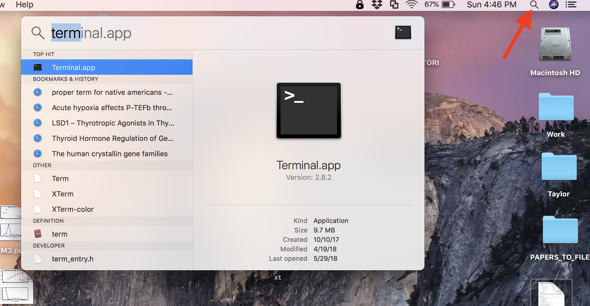

# A Brief Introduction to the UNIX Command Line
With the advent of next-generation sequencing and the era of 'Big Data', it is becoming increasingly necessary for researchers to develop basic computational skills.  As a result, at some point in time you will encounter software that does not run via a convenient and user-friendly graphical user interface (GUI).  Although all of us would love a pretty GUI for every program we use, there are certain advantages to interacting with a computer (e.gs., a personal computer, server, or cluster) via a command line interface. A command line interface often allows for:  
- Increased flexibility
- More parameter choices and options
- More memory efficient
- Easier configuration as operating systems change or get updated
- Sharing of methods (i.e., the code) with others
- Perhaps most importantly, the ability to concatenate multiple software into convenient, streamlined pipelines that can be sent to servers for rapid, large-scale analyses.

## Objectives
Here we will briefly learn how to interact with a UNIX computer via the command line. UNIX is the basis for both Mac and Linux computers, which includes most servers you may encounter. The way to interact with a UNIX computer is called the 'interpreter' or 'SHELL'.  On a Mac or Linux computer the default is called BASH. Although other SHELLs exist, we will use BASH below. Our goals are to learn some fundamental commands to perform many of the same tasks you would normally do on a daily basis, such as:  
1. changing directories (aka, folders): `cd`
2. creating directories: `mkdir`
3. view contents of a directory: `ls`
4. create files: `touch` or `>`
5. copy files: `cp`
6. move or renames files: `mv`
7. open or view files `cat`, `head`, `tail`, `more`, `less`
8. print text to the screen or to files: `echo`
9. remove files or directories: `rm` or `rmdir`

Before we begin, you will need to open the 'terminal' on your MacBook Pro computers.  Simply search for \"terminal\" using the magnifying glass in the upper right-hand corner and select the terminal application.  See the red arrow in the image below:  

Then, simply follow the tutorial below.  The actual commands to enter in the terminal will appear in light grey boxes below.  Although you can copy and paste these commands, we suggest you type them in yourself until you get more familiar with the terminal.  We will learn a few tricks of the trade as we go along as well.
Here we go!!!
