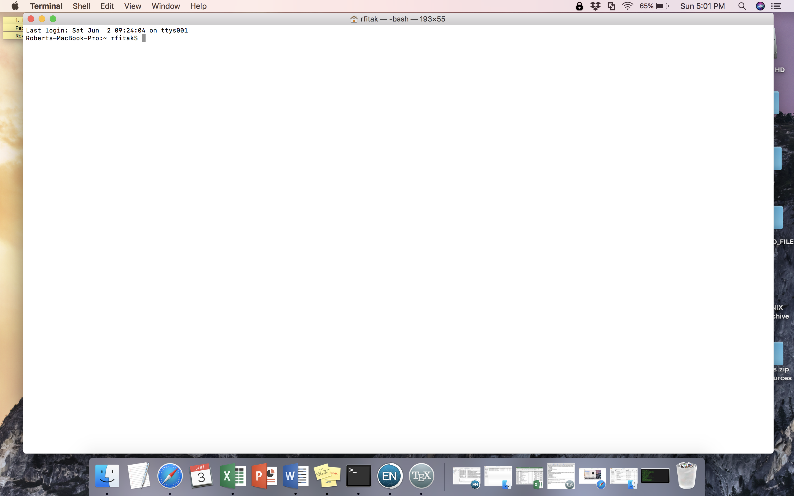

#A Brief Introduction to the UNIX Command Line
With the advent of next-generation sequencing and the era of 'Big Data', it is becoming increasingly necessary for researchers to develop basic computational skills.  As a result, at some point in time you will encounter software that does not run via a convenient and user-friendly graphical user interface (GUI).  Although all of us would love a pretty GUI for every program we use, there are certain advantages to interacting with a computer (e.gs., a personal computer, server, or cluster) via a command line interface. A command line interface often allows for:  
- Increased flexibility
- More parameter choices and options
- More memory efficient
- Easier configuration as operating systems change or get updated
- Sharing of methods (i.e., the code) with others
- Perhaps most importantly, the ability to concatenate multiple software into convenient, streamlined pipelines that can be sent to servers for rapid, large-scale analyses.

##Objectives
Here we will briefly learn how to interact with a UNIX computer via the command line. UNIX is the basis for both Mac and Linux computers, which includes most servers you may encounter. The way to interact with a UNIX computer is called the 'interpreter' or 'SHELL'.  On a Mac or Linux computer the default is called BASH. Although other SHELLs exist, we will use BASH below. Our goals are to learn some fundamental commands to perform many of the same tasks you would normally do on a daily basis, such as:  
1. changing directories (aka, folders): `cd`
2. creating directories: `mkdir`
3. view contents of a directory: `ls`
4. create files: `touch` or `>`
5. copy files: `cp`
6. move or renames files: `mv`
7. open or view files `cat`, `head`, `tail`, `more`, `less`
8. print text to the screen or to files: `echo`
9. remove files or directories: `rm` or `rmdir`

Before we begin, you will need to open the 'terminal' on your MacBook Pro computers.  Simply search for \"terminal\" using the magnifying glass in the upper right-hand corner and select the terminal application.  See the red arrow in the image below:  


Did you open the terminal?  If so, it should look something like this:  



Next, simply follow the tutorial below.  The actual commands to enter in the terminal will appear in light grey boxes below.  Although you can copy and paste these commands, we suggest you type them in yourself until you get more familiar with the terminal.  We will learn a few tricks of the trade as we go along as well.
Here we go!!!

###Step 1:  changing directories
Normally, when you open your computer, you start in the Desktop by default.  The Desktop is actually a directory (folder) in your computer's file system.  When you open a new session in the terminal, you most likely will start in a different location.  To find out where your terminal is 'located', enter the command:
```
pwd
```
Make sure to always press the 'enter' (or 'return') key to execute the command.
The terminal should print your current location, or 'path'.  The path starts with the root of the computer file system, or `/`, and then lists various folders inside of folders until you get to your current location.  Most likely this will not be the Desktop.  To change into the Desktop directory, simply enter:
```
cd Desktop
```
Now if you enter the command `pwd`, your location should have changed.  Go ahead and check.  
Next, if you want to back up one level in the directory hierarchy, enter:
```
cd ..
```
The shortcut `..` always means "up one level" in UNIX.  You could always replace the `..` with the full text of the path you want to go.  If you are ever not sure of your location, and want to return to this "Home" location of where started from, then enter:
```
cd ~
```
The `~` always refers to this preset Home location.  Check your location using `pwd`, and then move again into the Desktop (`cd Desktop`).  
Great job so far!!!

###Step 2:  making a directory
It is often the case that you will want to make a new directory, and store a bunch of cool files in it.  This is a really easy task.  Simply enter:
```
mkdir Practice
```
This will make a new directory called "Practice" in the Desktop.  Feel free to change "Practice" to anything you would like.  
###NOTE:  Avoid using space in folder or filenames, they can cause a lot of problems.  Use "_" instead!!!
Minimize the terminal and look at your Desktop.  Is your folder there?
Great!  Now move into this new folder:
```
cd Practice
```
Piece of cake, huh!

###Step3: listing contents
Now we will look at see which directories and files are inside of a folder.  But first, let's move back to the Desktop.
```
cd Desktop
```

Now, enter the command:
```
ls
```
The contents of the Desktop should be printed to the screen.  Does this match what you see when you look at the computer's Desktop?  
Now let's look at a more detailed list of the contents:
```
ls -l
```
This lists permissions, owners, sizes, dates, etc. for each item.  
We can also look at all the contents of a different directory:
```
ls -l ..
```
Which directory does this show the contents for?  
What about:
```
ls -l Practice
```
If you are ever not sure how to use a command, you can always use the `man` command for a commands manual, or Google (Googling is a GREAT resource).
```
man ls
```
To exit the manual for ls, enter `q`.

#Step 4: making files
Before we make some new files, let's move back into our Practice directory:
```
cd Practice
```


